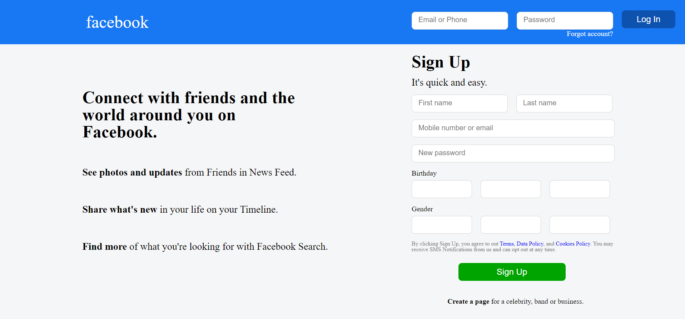

Facebook Homepage Template HTML5, CSS3  

Link to site: https://fbhomepagetemplate.netlify.app/

How It's Made:

Tech used: HTML5, CSS3

My learning was focused on practicing to replicate a given image of a website - using floats for added difficulty.

*SITE WAS NOT YET MADE TO BE RESPONSIVE*
